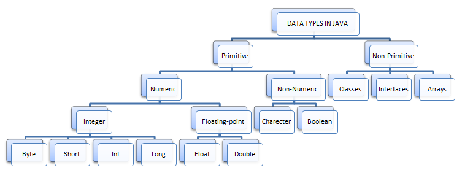

# Introducing TypeScript

TypeScript (TS, TScript or "typescript") is a programming language for web development based on JavaScript.
Makes the code clearer and more reliable, adds static typing (variables are bound to specific data types), and
can also be compiled into JavaScript.

* Properties of Type-Script
> Typescript is a superset of JavaScript

> TypeScript provides various other features,
like interfaces, type aliases, abstract classes,
function overloading, tuple, generics, etc

> It allows you to code in a manner so that your
code faces much less error in the run time or
production.

## Types in Type-Script

* 1.Primitive
* 2.Objects

# TypeScript Data Types

## 1. Number
Represents both integer and floating-point numbers.

Example:
> let num: number = 10;

## 2. String
Represents a sequence of characters.

Example:
> let str: string = "Hello, TypeScript!";

## 3. Boolean
Represents a logical value - true or false.

Example:
> let isTrue: boolean = true;

## 4. Array
Represents a collection of elements.

Example:
> let arr: number[ ] = [1, 2, 3, 4, 5];

## 5. Tuple
Represents an array with a fixed number of elements whose types are known.

Example:
> let tuple: [string, number] = ["TypeScript", 2021];

## 6. Enum
Represents a set of named constants.

Example:
> enum Color {Red, Green, Blue};
let c: Color = Color.Green;

## 7. Any
Represents any type, allowing for dynamic typing.

Example:
> let variable: any = "This can be anything!";

## 8. Void
Represents the absence of a type.

Example:
> function logMessage(): void {
    console.log("This function doesn't return anything.");
}

## 9. Null and Undefined
Represents null and undefined values.

Example:
> let n: null = null;
let u: undefined = undefined;

## 10. Never
Represents the type of values that never occur.

Example:
> function throwError(message: string): never {
    throw new Error(message);
}

## 11. Object
Represents non-primitive types, such as functions, arrays, and objects.

Example:
> let obj: object = { name: "TypeScript", year: 2012 };

# Differences between  Interface , Ennum and Tuple

1. Interface:
- An interface in TypeScript is a way to define a contract for an object. It can be used to define the shape of an object, including its properties, methods, and their types.
- Interfaces are used for defining custom data types and ensuring that objects adhere to a specific structure.
- They are typically used for defining the shape of objects and providing type safety when working with complex data structures.

Example:
>interface Person {
    name: string;
    age: number;
}

>const person: Person = {
    name: 'Alice',
    age: 30,
};

2. Enum:
- An enum in TypeScript is a way to define a set of named constants. It allows you to create a collection of related values that can be assigned to a variable.
- Enums are useful for representing a fixed set of values, such as days of the week, status codes, or other constant values.
- Each member of an enum has an associated numeric value by default, but you can also customize the numeric value or use string enums.

Example:
> enum Color {
    Red,
    Green,
    Blue,
}

>let bgColor: Color = Color.Blue;

3. Tuple:
- A tuple in TypeScript is an array-like data structure that allows you to specify the types of its elements and their order. Tuples can contain elements of different types and have a fixed length.
- Tuples are useful when you want to represent a fixed number of elements with different types in a specific order.
- They provide type safety for arrays by specifying the types and the exact number of elements at each position.

Example:
>let person: [string, number] = ['Alice', 30];

"# Type_Script" 
"# Type_Script" 
